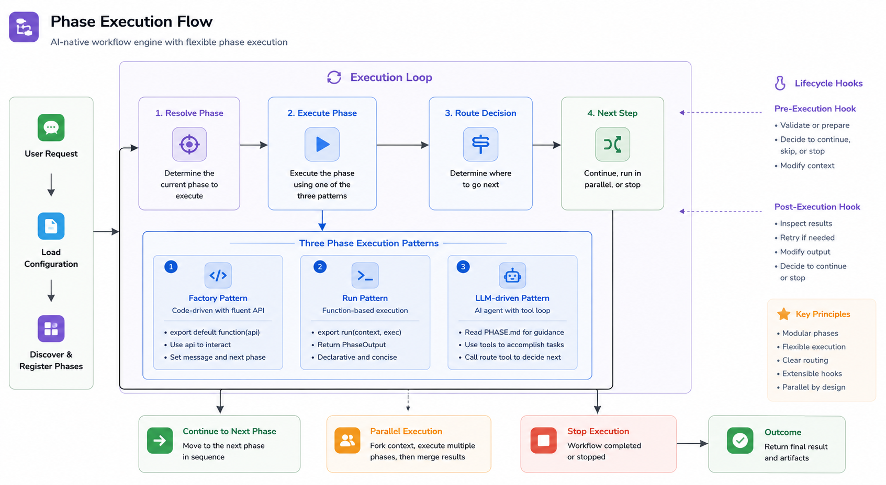

# Rowan Agent

>A composable, self-evolving agent loop for agentic workflows.

[](https://www.typescriptlang.org/)
[](https://bun.sh/)
[](LICENSE)

Rowan replaces opaque prompt loops with explicit, controllable workflows — structured `phases` that improve over time.



Key Principles:
- **Composable, programmable loop**: Standardizes agent loop into structured `phases` like research, planning, verification — each defined by executable code or prompt, no more hallucination.
- **Self-improving workflow**: Phases are composable, reusable, and evolvable — runtime feedback iterates on them over time.
- **Extensible by design**: Add custom phases, tools, skills, and providers without touching the core runtime.

See details in [docs/phases](packages/agent/docs/phases.md), [docs/extensions](packages/agent/docs/extensions.md).

## Quick Start

Clone the repository and install dependencies:

```bash
git clone https://github.com/aiirobyte/rowan-agent.git
cd rowan-agent
bun install
```

Run a one-shot prompt with explicit model flags:

```bash
bun run rowan \
  --model gpt-4.1-mini \
  --api-key "$OPENAI_API_KEY" \
  "list the files in this directory"
```

For repeat use, copy the example multi-provider config into `.rowan/config.yaml`:

```bash
mkdir -p .rowan
cp examples/config.yaml .rowan/config.yaml
```

## What is Rowan Agent?

The core idea is **Loop Engineering**: the agent loop is treated as reusable product code. Each Run has context, Tools, Phases, Durable Run Events, and a terminal outcome. As those pieces improve, the agent's process improves by building your own `phase`.

## Architecture

```
rowan-agent/
├── packages/
│   ├── models/    # Model registry, provider dispatch, SSE streaming, cost calculation
│   ├── agent/     # Durable Runtime: Runs, Tools, Skills, phases, extensions
│   ├── logging/   # Durable Run Event loggers with secret redaction
│   └── cli/       # Command-line interface
├── examples/      # Config, phase, and extension examples
└── package.json
```

```
@rowan-agent/cli
    ├── @rowan-agent/agent
    │       └── @rowan-agent/models
    ├── @rowan-agent/models
    └── @rowan-agent/logging
            └── @rowan-agent/agent
                    └── @rowan-agent/models
```

## CLI & Configuration Examples

```bash
bun run rowan "what files are in this directory?"
bun run rowan --model gpt-4.1-mini "use a different model"
bun run rowan config                # print resolved config (secrets redacted)
```

Model configuration lives at `<workspace>/.rowan/config.yaml`:

```bash
cp examples/config.yaml .rowan/config.yaml
```

## Development

```bash
bun run build           # Type-check all packages
bun run build:packages  # Build distributable packages
bun test                # Run all tests
bun test packages/agent # Run tests for a specific package
```

Release scripts:

```bash
bun run build:packages
bun run publish:packages
bun run release
```

## Documentation

| Doc | Description |
|-----|-------------|
| [Agent package README](packages/agent) | Durable Runtime API, Runs, Tools, events, phases, extensions, config |
| [Models package README](packages/models) | Model registry, providers, streaming, protocol types |
| [Logging package README](packages/logging) | Console and Pino Durable Run Event loggers |
| [CLI package README](packages/cli) | CLI usage, options, Runs, and output behavior |
| [Examples](examples) | Config templates, extension examples, phase examples |
| [Phases](packages/agent/docs/phases.md) | `PHASE.md` format, routing, execution modes, parallel phases |
| [Extensions](packages/agent/docs/extensions.md) | Extension discovery, hooks, tools, phases, providers, event bus |

## Acknowledgements

Inspired by [pi-agent-core](https://github.com/badlogic/pi-mono) and [Cahciua](https://github.com/Menci/Cahciua).

## License

MIT - see [LICENSE](LICENSE) for details.
