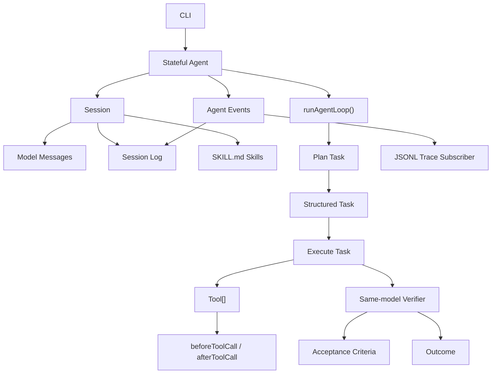

# Rowan Agent Technical Architecture

> 版本：0.3  
> 日期：2026-05-01  
> 状态：v0 架构已定稿；v0.1 OpenAI-compatible StreamFn 已实现，待真实 API 手动验收  
> 输入文档：`docs/ROADMAP.md`、`docs/v0/PLAN.md`、`docs/v0.1/PLAN.md`

## 1. 架构目标

Rowan v0 的目标是实现一个最简 Agent 内核：

```text
Session
  -> Agent
  -> Task
  -> Tool calls
  -> Acceptance criteria verification
  -> Outcome
  -> Session log / JSONL trace
```

这个内核要满足：

- Agent 可以同时承担 planner 和 executor。
- Task 有结构化 acceptance criteria。
- Tool 调用有 schema validation。
- Verification 先由同一个模型完成。
- Session log 和 model messages 分离。
- Skill 以 `SKILL.md` 形式作为可执行能力加载。
- JSONL trace 通过事件订阅写入。

## 2. v0 总体架构



## 3. v0 文件结构

v0 使用单包结构，不拆 `packages/*`。

```text
.
  package.json
  bun.lock
  tsconfig.json
  README.md

  src/
    index.ts
    types.ts
    agent.ts
    agent-loop.ts
    session.ts
    task.ts
    stream.ts
    tools.ts
    verifier.ts
    skills.ts
    trace-jsonl.ts
    cli.ts

  test/
    agent-loop.test.ts
    agent.test.ts
    task.test.ts
    verifier.test.ts
    trace-jsonl.test.ts

  skills/
    example/
      SKILL.md
```

## 4. 核心对象关系

```text
Agent
  owns AgentState
  owns Session
  runs agentLoop
  emits AgentEvent

Session
  owns model messages
  owns session log
  owns loaded skills

Task
  owns instruction
  owns acceptance criteria
  owns allowed tool names
  owns skill ids

Tool
  validates args
  executes action
  returns ToolResult

Verifier
  checks criteria
  returns VerificationResult

Outcome
  user-facing result
  includes evidence
```

## 5. Core Types

### 5.1 Session

```ts
interface Session {
  id: string;
  systemPrompt: string;
  userInput: string;
  messages: AgentMessage[];
  log: AgentEvent[];
  skills: Skill[];
  createdAt: string;
  updatedAt: string;
}
```

`messages` 和 `log` 必须分离：

- `messages`：发给模型的上下文。
- `log`：完整运行事件，可写入 trace。

### 5.2 Agent

```ts
interface AgentState {
  session: Session;
  model: ModelRef;
  tools: Tool[];
  isRunning: boolean;
  currentTask?: Task;
  currentOutcome?: Outcome;
  error?: string;
}

class Agent {
  prompt(input: string): Promise<Outcome>;
  abort(reason?: string): void;
  waitForIdle(): Promise<void>;
  subscribe(listener: AgentEventListener): Unsubscribe;
}
```

### 5.3 Task and Criteria

```ts
interface Task {
  id: string;
  title: string;
  instruction: string;
  acceptanceCriteria: AcceptanceCriterion[];
  toolNames: string[];
  skillIds: string[];
  status: "pending" | "running" | "passed" | "failed";
  attempts: number;
}

type AcceptanceCriterion =
  | {
      id: string;
      type: "model_judge";
      description: string;
      required: boolean;
    }
  | {
      id: string;
      type: "tool_observation";
      description: string;
      toolName?: string;
      required: boolean;
    };
```

### 5.4 Tool

```ts
interface Tool<TArgs = unknown> {
  name: string;
  description: string;
  parameters: TSchema;
  execute(
    args: TArgs,
    context: ToolContext,
    signal?: AbortSignal
  ): Promise<ToolResult>;
}
```

v0 不做 `ToolRegistry`。Agent state 直接持有 `Tool[]`。

### 5.5 Skill

```ts
interface Skill {
  id: string;
  path: string;
  content: string;
  toolNames?: string[];
}
```

v0 的 `Skill` 是 `SKILL.md` 可执行能力说明，注入模型上下文。真正的 skill 脚本沙箱、依赖管理、自动发现后置。

## 6. Agent Loop

v0 loop 分三段：

```text
plan task
  -> execute task with tools
  -> verify acceptance criteria
```

```ts
async function runAgentLoop(input: AgentLoopInput): Promise<Outcome> {
  const task = await planTask(input);
  emit("task_created", { task });

  for (let attempt = 1; attempt <= input.maxAttempts; attempt++) {
    const execution = await executeTaskWithTools(task, input);
    const verification = await verifyTask(task, execution, input);

    if (verification.passed) {
      return createOutcome(task, verification);
    }
  }

  return createFailedOutcome(task);
}
```

## 7. StreamFn

v0 使用轻量 `StreamFn`，不做 provider registry。

```ts
type StreamFn = (
  model: ModelRef,
  context: LlmContext,
  options: StreamOptions
) => AsyncIterable<ModelStreamEvent>;
```

v0 必须实现 `FakeStreamFn`。真实模型 adapter 后置到 v0.1。

## 8. Tool Hooks

v0 权限与拦截先用 hooks。

```ts
type BeforeToolCall = (input: {
  task: Task;
  tool: Tool;
  args: unknown;
}) => Promise<{ allow: true } | { allow: false; reason: string }>;

type AfterToolCall = (input: {
  task: Task;
  tool: Tool;
  result: ToolResult;
}) => Promise<ToolResult>;
```

完整 `PolicyEngine` 后置到 v0.3。

## 9. Verifier

v0 verifier 由同一个模型完成。

```ts
interface VerificationResult {
  passed: boolean;
  message: string;
  evidence: Evidence[];
  failedCriteria: string[];
}
```

后续 v0.5 再加入 scorer。

## 10. Events and Trace

v0 事件生命周期：

```text
session_start
message_start
message_delta
message_end
task_created
task_attempt_start
tool_call_start
tool_call_end
verification_start
verification_end
outcome
session_end
error
```

Trace 是 subscriber：

```ts
agent.subscribe(jsonlTraceWriter(".rowan/runs/latest.jsonl"));
```

v0 不做 trace reader、replay、fork。

## 11. CLI

```bash
bun run rowan --fake "hello"
bun run rowan --fake "use echo tool"
bun run rowan --fake --trace .rowan/runs/latest.jsonl "use echo tool"
```

CLI 只负责：

- 创建 Agent。
- 注入 `FakeStreamFn`。
- 注入 demo tools。
- 可选加载 skill。
- 可选挂 JSONL trace subscriber。
- 输出 outcome。

## 12. Future Modular Architecture

v0 完成后，再按能力拆模块：

```text
packages/
  core/       Agent, Session, Task, Tool, Verifier, Events
  cli/        command interface
  trace/      trace reader, replay, fork
  aci/        workspace tools
  eval/       datasets and scorers
  workflow/   graph executor
  adapters/   real model providers
```

拆包条件：

- v0 API 稳定。
- 至少一个真实模型 adapter 完成。
- workspace ACI 开始引入多工具。
- trace 不再只是 writer，需要 reader/replay。

## 13. v0.1 Real Model Runtime

v0.1 在 v0 的 `StreamFn` 边界上增加真实模型接入：

```text
Agent Loop
  -> OpenAI-compatible StreamFn
  -> Chat Completions fetch client
  -> JSON extraction
  -> TypeBox validation
  -> ModelStreamEvent
```

v0.1 不改变 `Agent`、`Session`、`Task`、`Tool`、`Verifier`、`Outcome`。

### 13.1 OpenAI-compatible StreamFn

```ts
function createOpenAICompatibleStream(config: OpenAICompatibleConfig): StreamFn
```

Config:

```ts
interface OpenAICompatibleConfig {
  baseUrl: string;
  apiKey: string;
  model: string;
  temperature?: number;
  timeoutMs?: number;
  fetch?: typeof fetch;
}
```

每个 phase 都通过 JSON contract 映射回 v0 events：

| Phase | Model Output | Rowan Event |
|---|---|---|
| plan | Task JSON | `structured_output` |
| execute | message + toolCalls JSON | `text_delta` + `tool_call` |
| verify | VerificationResult JSON | `structured_output` |

### 13.2 Provider Strategy

v0.1 只做 OpenAI-compatible Chat Completions：

- `POST /v1/chat/completions`
- `response_format: { type: "json_object" }` 可配置启用/禁用
- prompt 仍要求只输出 JSON
- 不做 native tool calling 兼容矩阵
- 不做 Anthropic/Gemini

## 14. Architecture Decisions

| ADR | Decision | v0 Default |
|---|---|---|
| ADR-0001 | Runtime | TypeScript + Bun |
| ADR-0002 | Project shape | Single package |
| ADR-0003 | Schema | TypeBox 1.x + `Schema.Compile()` |
| ADR-0004 | Model abstraction | `StreamFn` |
| ADR-0005 | Tool collection | `Tool[]` |
| ADR-0006 | Policy | hooks first |
| ADR-0007 | Trace | JSONL subscriber |
| ADR-0008 | Skill | `SKILL.md` |
| ADR-0009 | First real model runtime | OpenAI-compatible `StreamFn` |
