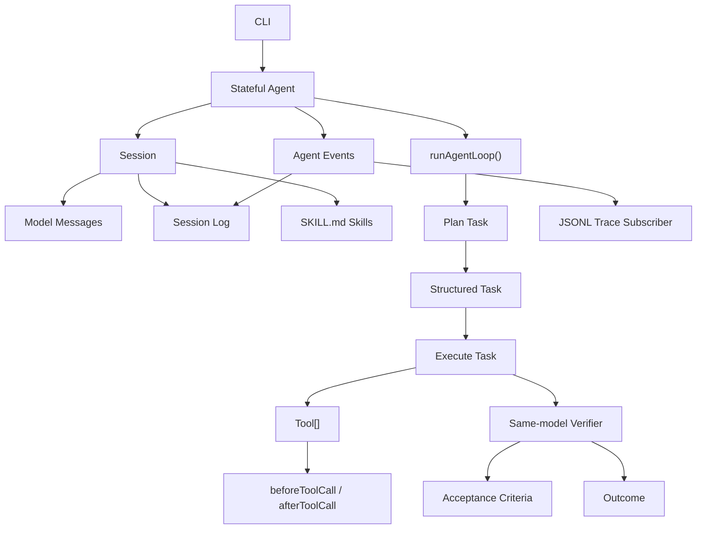

# Rowan v0 Plan

> 版本：v0  
> 日期：2026-04-30  
> 状态：已定稿，可直接执行  
> 技术栈：TypeScript + Bun  
> 任务表：`docs/v0/TASKS.md`

## 1. v0 目标

v0 是 Rowan 的最简 Agent 内核版本。

它不做平台，不做 monorepo，不做 eval，不做 sub-agent，不做 workflow。v0 只跑通一个核心闭环：

```text
Session
  -> Agent
  -> Task
  -> Tool calls
  -> Acceptance criteria verification
  -> Outcome
  -> Session log / JSONL trace
```

v0 的产品目标：

> 一个有状态 Agent 能接收用户输入，生成结构化 task，调用工具执行，使用同一个模型验证 acceptance criteria，最后输出 outcome，并保留完整 session log。

## 2. 已确认决策

| 决策点 | v0 决策 |
|---|---|
| Agent 角色 | 同一个 Agent 同时承担 planner 和 executor |
| Planner / executor 关系 | 不拆独立 planner；planner 只是同一个 Agent 的一次模型/工具调用阶段 |
| Task 粒度 | v0 先只做 task，不做 sub-agent |
| Acceptance criteria | 使用结构化 schema 表示 |
| Verification | v0 先用同一个模型判断；后续再加 scorer |
| Session log vs Message | 不合并；log 是完整运行事件，messages 是模型请求上下文 |
| Skill | 可执行能力，以 `SKILL.md` 形式加载，类似 Codex skill |
| Trace | JSONL event subscriber |
| Policy | `beforeToolCall` / `afterToolCall` hook，不做完整 PolicyEngine |
| Runtime | TypeScript + Bun |
| Schema | TypeBox 1.x + built-in `Schema.Compile()` validation |

## 3. v0 范围

### 3.1 必做

- TypeScript + Bun 单包项目。
- Stateful `Agent` class。
- Low-level `runAgentLoop()`。
- `Session`，并分离 `messages` 与 `log`。
- 结构化 `Task`。
- 结构化 `AcceptanceCriterion`。
- demo `Tool` 和 tool args validation。
- `beforeToolCall` / `afterToolCall` hooks。
- 同模型 verifier。
- `Outcome`。
- `SKILL.md` loader。
- JSONL trace subscriber。
- 最小 CLI。
- Bun test 覆盖核心 loop。

### 3.2 不做

- 不做 `packages/*` monorepo。
- 不做 real model adapter。
- 不做 workspace ACI。
- 不做 shell/network/file write tools。
- 不做 eval runner。
- 不做 replay/fork。
- 不做 full policy engine。
- 不做 sub-agent。
- 不做 workflow graph。
- 不做 MCP。
- 不做 Web UI。

## 4. 技术假设

| 项 | v0 决策 |
|---|---|
| Runtime | Bun |
| Language | TypeScript |
| Package manager | Bun |
| Module system | ESM |
| Test runner | Bun test |
| CLI | Bun script；先用 `process.argv`，复杂后再引入 Commander |
| Schema | TypeBox 1.x + `Schema.Compile()` |
| First model | Fake stream model |
| Real model adapter | 后置到 v0.1 |
| Trace format | JSONL |
| Skill format | `skills/<skill-key>/SKILL.md` |

选择 TypeBox 1.x 的原因：

- 接近 pi-agent 的 schema 风格。
- 能自然产生 JSON Schema。
- 比纯手写 JSON Schema 更适合 TypeScript 类型推导。
- 自带 schema compiler / validator，v0 不需要 AJV。

v0 推荐用法：

```ts
import Type from "typebox";
import Schema from "typebox/schema";

const TaskSchema = Type.Object({
  id: Type.String(),
  title: Type.String(),
  instruction: Type.String(),
  acceptanceCriteria: Type.Array(Type.Unknown()),
  toolNames: Type.Array(Type.String()),
  skillIds: Type.Array(Type.String()),
});

type Task = Type.Static<typeof TaskSchema>;

const TaskValidator = Schema.Compile(TaskSchema);
const task = TaskValidator.Parse(value);
```

## 5. Scaffold

### 5.1 初始化命令

```bash
bun init
bun add typebox
bun add -d typescript @types/bun
```

### 5.2 package scripts

```json
{
  "type": "module",
  "scripts": {
    "build": "tsc --noEmit",
    "test": "bun test",
    "rowan": "bun src/cli.ts"
  }
}
```

### 5.3 tsconfig 重点

```json
{
  "compilerOptions": {
    "target": "ES2022",
    "module": "ESNext",
    "moduleResolution": "Bundler",
    "strict": true,
    "noEmit": true,
    "types": ["bun-types"]
  },
  "include": ["src", "test"]
}
```

## 6. 目标目录结构

```text
.
  package.json
  bun.lock
  tsconfig.json
  README.md

  src/
    index.ts
    types.ts
    agent.ts
    agent-loop.ts
    session.ts
    task.ts
    stream.ts
    tools.ts
    verifier.ts
    skills.ts
    trace-jsonl.ts
    cli.ts

  test/
    agent-loop.test.ts
    agent.test.ts
    task.test.ts
    verifier.test.ts
    trace-jsonl.test.ts

  skills/
    example/
      SKILL.md
```

## 7. 核心架构



## 8. 核心类型

### 8.1 Session

```ts
interface Session {
  id: string;
  systemPrompt: string;
  userInput: string;
  messages: AgentMessage[];
  log: AgentEvent[];
  skills: Skill[];
  createdAt: string;
  updatedAt: string;
}
```

`messages` 和 `log` 必须分离：

- `messages`：发给模型的上下文。
- `log`：完整运行事件，可写入 JSONL trace。

### 8.2 Agent

```ts
interface AgentState {
  session: Session;
  model: ModelRef;
  tools: Tool[];
  isRunning: boolean;
  currentTask?: Task;
  currentOutcome?: Outcome;
  error?: string;
}

class Agent {
  prompt(input: string): Promise<Outcome>;
  abort(reason?: string): void;
  waitForIdle(): Promise<void>;
  subscribe(listener: AgentEventListener): Unsubscribe;
}
```

v0 不要求 `steer()`、`followUp()`、`continue()`。

### 8.3 Task

```ts
interface Task {
  id: string;
  title: string;
  instruction: string;
  acceptanceCriteria: AcceptanceCriterion[];
  toolNames: string[];
  skillIds: string[];
  status: "pending" | "running" | "passed" | "failed";
  attempts: number;
}
```

v0 只支持一个当前 task，task queue 后置。

### 8.4 Acceptance Criteria

```ts
type AcceptanceCriterion =
  | {
      id: string;
      type: "model_judge";
      description: string;
      required: boolean;
    }
  | {
      id: string;
      type: "tool_observation";
      description: string;
      toolName?: string;
      required: boolean;
    };
```

v0 判断方式：

- `model_judge`：同一个模型根据 task、messages、tool outputs 判断。
- `tool_observation`：v0 仍可交给同一个模型判断，但保留后续 scorer 扩展位。

### 8.5 Outcome

```ts
interface Outcome {
  id: string;
  taskId: string;
  passed: boolean;
  message: string;
  evidence: Evidence[];
  failedCriteria: string[];
}
```

### 8.6 Skill

```ts
interface Skill {
  id: string;
  path: string;
  content: string;
  toolNames?: string[];
}
```

v0 的 skill 能力范围：

- 从 `skills/<id>/SKILL.md` 加载文本。
- 将 skill 内容注入模型上下文。
- 可选声明该 skill 期望使用的工具名。

## 9. StreamFn

v0 采用 pi-agent 风格的 `StreamFn`，不做 ModelAdapter 注册系统。

```ts
type StreamFn = (
  model: ModelRef,
  context: LlmContext,
  options: StreamOptions
) => AsyncIterable<ModelStreamEvent>;
```

`ModelStreamEvent` 至少支持：

```ts
type ModelStreamEvent =
  | { type: "text_delta"; text: string }
  | { type: "tool_call"; toolCall: ToolCall }
  | { type: "structured_output"; value: unknown }
  | { type: "done" };
```

v0 必须实现 `FakeStreamFn`：

- 输出普通文本。
- 输出结构化 task。
- 输出 tool call。
- 输出 verification 结果。
- 模拟错误。

## 10. Tool

```ts
interface Tool<TArgs = unknown> {
  name: string;
  description: string;
  parameters: TSchema;
  execute(
    args: TArgs,
    context: ToolContext,
    signal?: AbortSignal
  ): Promise<ToolResult>;
}
```

v0 不做 ToolRegistry。Agent state 直接持有 `Tool[]`。

### 10.1 Tool Hooks

```ts
type BeforeToolCall = (input: {
  task: Task;
  tool: Tool;
  args: unknown;
}) => Promise<{ allow: true } | { allow: false; reason: string }>;

type AfterToolCall = (input: {
  task: Task;
  tool: Tool;
  result: ToolResult;
}) => Promise<ToolResult>;
```

### 10.2 Demo Tools

| Tool | 用途 |
|---|---|
| `echo` | 返回输入，用于测试 |
| `now` | 返回当前时间，用于工具调用测试 |
| `read_skill` | 读取已加载 skill 内容，可选 |

## 11. Verifier

v0 的 verifier 使用同一个 `StreamFn`。

```ts
interface Verifier {
  verify(input: {
    task: Task;
    messages: AgentMessage[];
    toolResults: ToolResult[];
    criteria: AcceptanceCriterion[];
  }): Promise<VerificationResult>;
}

interface VerificationResult {
  passed: boolean;
  message: string;
  evidence: Evidence[];
  failedCriteria: string[];
}
```

## 12. Agent Loop

v0 loop 分三个阶段：

```text
1. Plan task
   user input + system prompt + skills -> structured Task

2. Execute task
   same Agent uses tools until it has enough evidence

3. Verify task
   same model checks structured acceptance criteria
   passed -> Outcome
   failed -> retry until maxAttempts, then failed Outcome
```

Pseudocode:

```ts
async function runAgentLoop(input: AgentLoopInput): Promise<Outcome> {
  emit("session_start");

  const task = await planTask(input);
  emit("task_created", { task });

  for (let attempt = 1; attempt <= input.maxAttempts; attempt++) {
    emit("task_attempt_start", { task, attempt });

    const execution = await executeTaskWithTools(task, input);
    emit("task_attempt_end", { task, attempt, execution });

    const verification = await verifyTask(task, execution, input);
    emit("verification_end", { task, verification });

    if (verification.passed) {
      const outcome = createOutcome(task, verification);
      emit("outcome", { outcome });
      emit("session_end");
      return outcome;
    }
  }

  const outcome = createFailedOutcome(task);
  emit("outcome", { outcome });
  emit("session_end");
  return outcome;
}
```

## 13. Events and Trace

v0 事件生命周期：

```text
session_start
session_end
message_start
message_delta
message_end
model_call
task_created
task_attempt_start
task_attempt_end
tool_call_start
tool_call_end
tool_call_blocked
verification_start
verification_end
outcome
error
```

`message_start.content` 记录初始 `session.messages` 数组，`message_delta.delta` 记录新增 `AgentMessage`，`message_delta.content` 记录追加后的完整数组，`message_end.content` 记录最终完整数组。`session_created` 不包含 messages、createdAt、updatedAt 或 messageCount。`model_call` 只记录消息数量和 provider token usage，不记录完整 prompt 或 raw response。

Trace 是 event subscriber：

```ts
agent.subscribe(jsonlTraceWriter(".rowan/runs/latest.jsonl"));
```

## 14. CLI

```bash
bun run rowan --fake "hello"
bun run rowan --fake "use echo tool"
bun run rowan --fake --trace .rowan/runs/latest.jsonl "use echo tool"
```

CLI 只负责：

- 创建 Agent。
- 注入 `FakeStreamFn`。
- 注入 demo tools。
- 可选加载 skill。
- 可选挂 JSONL trace subscriber。
- 输出 outcome。

## 15. Milestones

| Milestone | 名称 | 目标 | 退出标准 |
|---|---|---|---|
| M0 | Scaffold | 单包 TypeScript + Bun 可运行 | `bun test` |
| M1 | Types and Schema | 定义 Session/Task/Criteria/Tool/Event | 类型测试通过 |
| M2 | Fake Stream | fake stream 覆盖 plan/execute/verify | fake stream 测试通过 |
| M3 | Agent Loop | 跑通 task -> tool -> verify -> outcome | loop 测试通过 |
| M4 | Agent Class | 提供 stateful Agent API | `agent.prompt()` 测试通过 |
| M5 | Skills | 加载 `SKILL.md` 并注入上下文 | skill 测试通过 |
| M6 | Trace | event subscriber 写 JSONL | trace 测试通过 |
| M7 | CLI | 最小 CLI 可运行 | `bun run rowan --fake "hello"` |
| M8 | Hardening | 边界、错误、文档补齐 | release checklist 通过 |

## 16. Release Checklist

- [ ] `bun install`
- [ ] `bun test`
- [ ] `bun run build`
- [ ] `bun run rowan --fake "hello"`
- [ ] `bun run rowan --fake "use echo tool"`
- [ ] `bun run rowan --fake --trace .rowan/runs/latest.jsonl "use echo tool"`
- [ ] Agent 能创建结构化 task。
- [ ] Acceptance criteria 使用结构化 schema。
- [ ] Agent 能调用 demo tool。
- [ ] 同一个模型能完成 verification。
- [ ] Session log 和 messages 分离。
- [ ] `SKILL.md` 能被加载并进入模型上下文。
- [ ] JSONL trace 包含 session/task/tool/verification/outcome 事件。
- [ ] unknown tool 返回结构化错误，不 crash。
- [ ] invalid tool args 不执行工具。
- [ ] `abort()` 能停止长任务。
